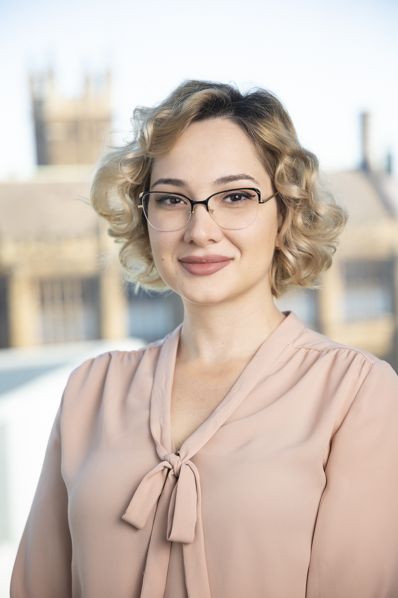

  

   
  

  

  
  I am a casual academic at the University of Sydney Law School teaching Public International Law. My area of research is investor-state dispute settlement (ISDS) with the focus on investor-state mediation. I hold PhD degree in law from the University of Sydney (Australia), LLM in Business and Commercial Law from the University of Manchester (UK) and LLB from the Tbilisi State University (Georgia).
  
  

